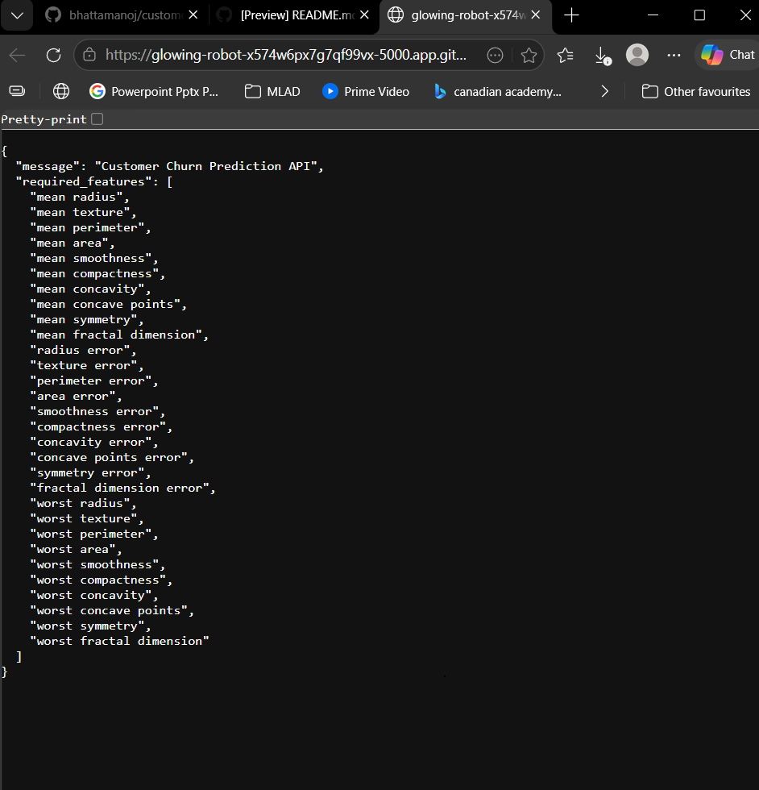
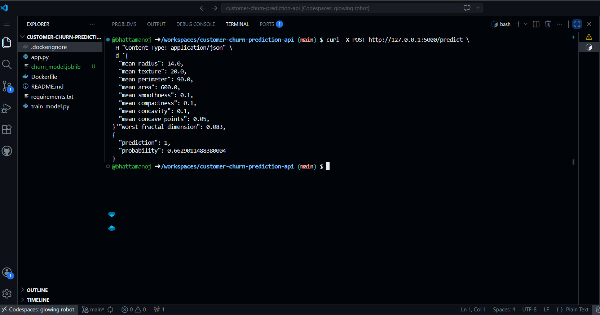

# Customer Churn Prediction API

## Project Overview
This project shows a simple machine learning API workflow using Python and Flask. We trained a classification model and exposed it through a prediction endpoint so the model could be used outside a notebook environment.

## Problem Statement
A prediction model becomes more useful when it can be accessed through an application or API. This project focuses on turning a classification model into a simple service that accepts input data and returns predictions.

## Solution
We trained a Logistic Regression model and saved it as a reusable file. Then we created a Flask API with a prediction endpoint.

The project includes:
- model training script
- saved model artifact
- Flask API
- prediction endpoint
- JSON response output
- Docker support

## Tools and Technologies
- Python
- scikit-learn
- Flask
- pandas
- joblib
- Docker

## Files
- `train_model.py` – trains and saves the classification model
- `app.py` – Flask API for predictions
- `requirements.txt` – project dependencies
- `Dockerfile` – container setup
- `.dockerignore` – Docker ignore rules
- `churn_model.joblib` – saved trained model

## How to Run

Install dependencies:

`pip install -r requirements.txt`

Train the model:

`python train_model.py`

Run the API:

`python app.py`

Then open:

`http://127.0.0.1:5000/`

## Docker Setup

Build the Docker image:

`docker build -t churn-api .`

Run the container:

`docker run -p 5000:5000 churn-api`

Then open:

`http://127.0.0.1:5000/`

## Results
The API project was completed successfully.

- The classification model was trained and saved as `churn_model.joblib`
- The Flask API ran successfully on port 5000
- The `/` route returned the required features in JSON format
- The `/predict` route returned a prediction and probability score

## Project Evidence

### API Home Response

### Prediction Response

## Key Results
This project shows how to move from model training to a simple API workflow. It gives a clear example of how machine learning can be connected to deployment and reproducibility.

## What We Learned
We learned how to save a trained model, load it into a Flask app, and return predictions through an API endpoint. Adding Docker also helped us understand how to package the project in a more reproducible way.

## Team Member
- Manoj Bhatta